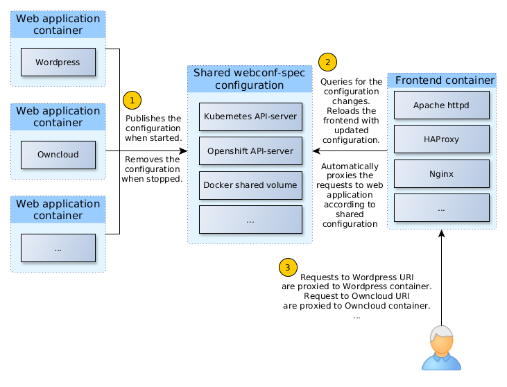

Table of Contents
=================

  * [What is micro-webapps?](#what-is-micro-webapps)
  * [Micro-webapps architecture](#micro-webapps-architecture)
  * [Micro-webapps frontends](#micro-webapps-frontends)
  * [Micro-webapps with Nulecule](#micro-webapps-with-nulecule)
    * [Nulecule examples](#nulecule-examples)
  * [Microwebapps without Nulecule](#microwebapps-without-nulecule)
  * [Documentation](#documentation)

# What is micro-webapps?
The goal of the micro-webapps project is to allow simple deployment of web applications in the cloud (multi container) environment. Admin is able to choose the frontend which will serve the web applications and then install the web applications as separate containers. For each web application, he is able to configure the URI on which the web application will be served.

It is therefore possible to setup webserver with, for example, following structure:

- `http://domain.tld/` running static content.
- `http://domain.tld/blog` running wordpress in separate container.
- `http://bugs.domain.tld` running Bugzilla in separate container.
- `http://another-domain.tld` running completely different domain.

# Micro-webapps architecture

The basic architecture of micro-webapps is ilustrated by this image:

Web applications are running in separate containers using the Kubernetes, Openshift, Docker or another container environment. When started, the web application publishes its webserver related configuration into some shared storage. This can be Kubernetes or Openshift API-server or for example the Docker shared volume.

The webserver configuration published by the web application is in the webserver-independent [webconf-spec](https://github.com/micro-webapps/webconf-spec) JSON format. This has multiple benefits:

- The developer of the web application writes single webserver configuration file and can be sure it will work with all the frontend webservers.
- The deployer of the web application can use whatever frontend webserver he wants.
- When the new webserver is created, the web applications do not have to be changed. There only have to exist the webconf-spec loader plugin for the webserver.

When the webserver configuration is published in the shared storage, the frontend webserver detects it and reloads its configuration to reflect the configuration of newly added web application. This allows transparent changes in the served applications and virtualhosts.

Later, when the client sends a request for the particular web application, the frontend webserver forwards it to the right container according to the frontend webserver configuration.

# Micro-webapps frontends

Currently, there are following micro-webapps frontends:

- [httpd-frontend](https://registry.hub.docker.com/u/microwebapps/httpd-frontend/) - Apache httpd frontend.
- [haproxy-frontend](https://registry.hub.docker.com/u/microwebapps/haproxy-frontend/) - HAProxy frontend.
- [nginx-frontend](https://registry.hub.docker.com/u/microwebapps/nginx-frontend/) - nginx frontend.

For the `httpd-frontend`, there exists extra `httpd-config-*` Docker images. These Docker images are used to inject extra configuration into the httpd-frontend container, so it is for example possible to serve static data on the particular virtualhost.

# Micro-webapps with Nulecule and Atomicapp

Using the [Nulecule](https://github.com/projectatomic/nulecule/) specification and its reference implementation - [The atomicapp project](https://github.com/projectatomic/atomicapp). It is possible to use micro-webapps for development, packaging and deployment of fully modular and self-contained web applications.

The developer of the web application can create single Docker image, which will deploy the application on all container environments and let the deployer to easily decide on which URI the web application should be running. In the end of deployment, the deployer has fully working web application without the need to touch the web application's or the frontend's configuration file.

## Nulecule examples

- [Owncloud](https://github.com/micro-webapps/micro-webapps/tree/master/nulecules/owncloud) - Example of the Owncloud web application using the micro-webapps and Nulecule.
- [Wordpress](https://github.com/micro-webapps/micro-webapps/tree/master/nulecules/wordpress) - Example of the Wordpress web application using the micro-webapps and Nulecule.

Also check Documentation, which describes how to create new micro-webapp nulecule.

# Micro-webapps without Nulecule and Atomicapp

It is also possible to use micro-webapps without the Nulecule project. Our GitHub repository contains the Kubernetes/Openshift pod/service files which can be deployed without the Nulecule or Atomicapp as described in Documentation.

# Documentation

This chapter contains useful documentation and examples how to use micro-webapps.

  * Creating micro-webapps
    * [Simple Owncloud example](docs/create-simple-owncloud-webapp.md)
    * [Multi-container Wordpress with MariaDB example](docs/create-multi-container-wordpress-webapp.md)
    * [Wordpress example with replication and load balancing](docs/create-wordpress-webapp-replication.md)
  * Deploying micro-webapps
    * [Atomicapp + Kubernetes](docs/deploy-owncloud-webapp-atomicapp-kubernetes.md)
    * [Atomicapp + Openshift](docs/deploy-owncloud-webapp-atomicapp-openshift.md)
    * [Kubernetes](docs/deploy-wordpress-webapp-kubernetes.md)
    * [Openshift](docs/deploy-wordpress-webapp-openshift.md)
  * [Frequently asked questions](docs/faq.md)
    * [What is the difference between micro-webapps and Kubernetes service](docs/faq.md#what-is-the-difference-between-micro-webapps-and-kubernetes-service)
    * [What is the difference between micro-webapps and Openshift3 routing layer](docs/faq.md#what-is-the-difference-between-micro-webapps-and-openshift3-routing-layer)
